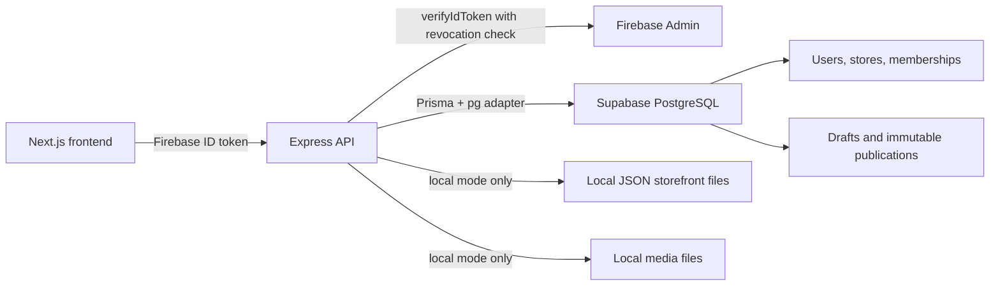
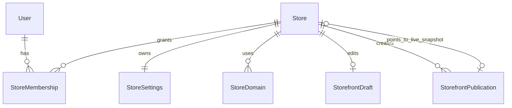

# Jellyshops backend: current status and architecture

Last updated: 2026-09-06

This document describes the backend as it exists in the repository today. It
separates working functionality from the cloud-runtime work that is still
pending, so it can be used as a development handover and deployment checklist.

## Current result

The backend can now support the first merchant lifecycle when its cloud
dependencies are injected: verify a Firebase ID token, create or resolve a
merchant account, create a tenant store, save a private storefront draft, and
publish an immutable public snapshot.

The database design and Prisma repositories are ready for Supabase PostgreSQL.
The application still starts in local demo mode by default. Runtime provider
selection and Supabase/Firebase resource construction remain the next work item
before a cloud deployment.

## Architecture



The intended cloud arrangement is Firebase Authentication for identity and
Supabase PostgreSQL for application data. The backend does not use Supabase Auth
or the Supabase Data API.

## What works now

### Database and migration foundation

- Prisma uses PostgreSQL and writes its generated client to
  `src/generated/prisma`.
- The phase-one migration creates tenant, storefront draft, and publication
  tables.
- Publication rows are protected by database triggers: they cannot be updated,
  deleted, or truncated after creation.
- Prisma uses the `@prisma/adapter-pg` adapter with a small application pool.
- Runtime URLs are validated as PostgreSQL URLs. Non-loopback hosts must specify
  TLS with `sslmode=require`, `verify-ca`, or `verify-full`.
- Integration tests create a unique PostgreSQL schema for every test suite and
  refuse databases other than a local `jellyshops_test` database.

### Merchant and tenant access

- A verified Firebase identity is resolved by `firebaseUid` first.
- A new verified identity creates one `User` record with no memberships.
- Existing users keep their existing stored name and email during this phase.
- An email collision with an account belonging to another or unlinked identity
  returns `409 ACCOUNT_LINK_REQUIRED`; the system never silently links accounts
  by email.
- Store memberships are loaded from the database for every authenticated
  request. There is no membership cache and token custom claims do not grant
  store access.
- Store creation is one transaction: `Store`, `StoreSettings` with `UTC`, and
  an `OWNER` membership are created together.
- New stores are always `NATIVE`. `SHOPIFY` remains a future schema option and
  cannot be selected through the API.

### Firebase authentication and roles

- Firebase Admin SDK version `14.3.0` is installed.
- Firebase tokens are checked through `verifyIdToken(token, true)`, including
  revocation checking.
- Missing or invalid credentials return `401 AUTH_INVALID`.
- Missing or unverified email returns `403 EMAIL_VERIFICATION_REQUIRED`.
- Firebase credential or network failures return `503 AUTH_UNAVAILABLE`.
- Verified email is trimmed and lowercased for new identities. A verified name
  is trimmed; missing names become an empty string.

| Role | Storefront draft | Publish | Media list | Media upload/delete |
| --- | --- | --- | --- | --- |
| OWNER | read/write | yes | read | yes |
| ADMIN | read/write | yes | read | yes |
| DESIGNER | read/write | yes | read | yes |
| ORDER_MANAGER | read | no | read | no |
| STAFF | read | no | read | no |

Every denied store operation returns `403 STORE_FORBIDDEN`.

### Storefront persistence

- A draft starts at revision `0` conceptually and is written as revision `1` on
  its first save.
- Save and publish transactions lock the same active store row with PostgreSQL
  `FOR UPDATE`. This serializes concurrent editing and publishing.
- A stale revision returns `409 DRAFT_CONFLICT` with `currentRevision`.
- Revisions are bounded by the signed 32-bit maximum. Overflow returns
  `409 REVISION_LIMIT_REACHED`.
- Publishing creates a new UUID publication snapshot from the current draft and
  updates the store's live-publication pointer in the same transaction.
- A failed pointer update rolls back the inserted publication.
- Retryable transaction conflicts retry at most three times, then return
  `503 DATABASE_BUSY`.
- An active store without a publication returns no public record. Missing or
  archived stores are hidden from public reads.

## Data model

The active schema is [`prisma/schema.prisma`](../prisma/schema.prisma). The
larger future commerce reference is in `prisma/reference/commerce.prisma` and
is not the active migration target.

| Model | Main data | Important rules |
| --- | --- | --- |
| `User` | Merchant profile, email, optional Firebase UID | Email and Firebase UID are unique. Firebase UID remains nullable to preserve legacy users. |
| `Store` | Tenant name, slug, currency, country, provider, archived status | Slug is unique. One live publication pointer belongs to the same store through a composite foreign key. |
| `StoreMembership` | User-to-store role | Composite primary key: one membership per user and store. |
| `StoreSettings` | Store timezone and contact email | One settings row per store. New stores use `UTC`. |
| `StoreDomain` | Future custom domain record | Hostname is unique; verification workflow is not built yet. |
| `StorefrontDraft` | Current editable JSON document and revision | One draft per store. Revision must be non-negative. |
| `StorefrontPublication` | Immutable published JSON snapshot | Source revision must be at least one. Database triggers block mutation and truncation. |

### Relationship map



## HTTP API

All JSON errors use this shape:

```json
{
  "error": {
    "code": "REQUEST_INVALID",
    "message": "The request is invalid",
    "issues": [{ "path": "slug", "message": "Invalid string" }],
    "requestId": "..."
  }
}
```

### Public and demo endpoints

| Method | Path | Status | Purpose |
| --- | --- | --- | --- |
| GET | `/health` | working | Returns `{ "ok": true }`. |
| GET | `/api/demo/catalog` | working | Returns the local demo catalog. |
| GET | `/api/stores/:storeId/storefront/public` | working | Reads the live publication without authentication. Returns `404 PUBLICATION_NOT_FOUND` when none is available. |
| GET | `/api/public/media/:storeId/:mediaId` | working in local mode | Streams stored local media. |

### Merchant endpoints

These are mounted only when an application runtime supplies a tenant repository.
They require `Authorization: Bearer <Firebase ID token>` in cloud mode.

| Method | Path | Response | Rules |
| --- | --- | --- | --- |
| GET | `/api/me` | `{ merchantId, stores }` | Resolves the authenticated merchant and lists current active memberships. |
| GET | `/api/stores` | `{ stores }` | Lists only the caller's active stores and their roles. |
| POST | `/api/stores` | `201 { store }` | Creates a native store and caller `OWNER` membership. |

`POST /api/stores` accepts only:

```json
{
  "name": "Jelly Goods",
  "slug": "jelly-goods",
  "currency": "USD",
  "country": "US"
}
```

Validation rules:

- `name`: trimmed, 1 to 120 characters.
- `slug`: lowercase letters or digits separated by single hyphens, 3 to 63
  characters.
- `currency`: three uppercase letters.
- `country`: two uppercase letters.
- Additional fields are rejected. The API does not accept `ownerId`, role,
  memberships, Firebase identity fields, or a commerce provider.

### Storefront endpoints

| Method | Path | Required access | Purpose |
| --- | --- | --- | --- |
| GET | `/api/stores/:storeId/storefront/draft` | storefront read | Returns the draft, or an in-memory default document at revision 0. |
| PUT | `/api/stores/:storeId/storefront/draft` | storefront write | Saves `{ expectedRevision, document }`. |
| POST | `/api/stores/:storeId/storefront/publish` | storefront write | Publishes `{ expectedRevision }`. |
| GET | `/api/stores/:storeId/storefront/public` | public | Returns the live immutable snapshot. |

`expectedRevision` must be a non-negative signed 32-bit integer.

### Media endpoints

| Method | Path | Required access | Purpose |
| --- | --- | --- | --- |
| GET | `/api/stores/:storeId/media` | media read | Lists a store's media records. |
| POST | `/api/stores/:storeId/media` | media write | Uploads one file in the `file` multipart field. Limit: 30 requests/minute per client. |
| DELETE | `/api/stores/:storeId/media/:mediaId` | media write | Removes unreferenced media. |

Media currently uses durable local files. GCS is configured as a future option but
is not implemented for production use on ephemeral hosts.

## Local mode and cloud target

### Local mode: working now

The default environment is:

```dotenv
AUTH_PROVIDER=development
REPOSITORY_PROVIDER=local-json
MEDIA_PROVIDER=local-files
```

Local storefront work uses the demo bearer token `jelly-demo-merchant` and the
configured `DEMO_STORE_ID` (default `store-demo`). Storefront documents are saved
as local JSON, and media is written below `UPLOAD_DIRECTORY`.

### Supabase target: database layer ready

Use two distinct secrets:

| Variable | Use | Recommended connection |
| --- | --- | --- |
| `DATABASE_URL` | Express runtime only | Least-privileged runtime role through Supavisor session mode, port 5432, with TLS. |
| `DIRECT_URL` | Prisma migrations and administrative checks only | Direct connection when IPv6 is available, otherwise session pooler. |

Never use Supavisor transaction mode (port 6543) for migrations. Do not expose
either URL in browser code or in a `NEXT_PUBLIC_` variable.

The intended Supabase roles are:

- `jellyshops_migrator`: owns and applies schema migrations.
- `jellyshops_runtime`: has CONNECT, schema USAGE, and only the table/sequence
  permissions required by the API. It must not alter tables or disable triggers.

## Configuration

Copy `.env.example` and set values for the selected providers. The config loader
currently validates provider-specific variables, including:

- `FIREBASE_PROJECT_ID` when `AUTH_PROVIDER=firebase`.
- `DATABASE_URL` when `REPOSITORY_PROVIDER=prisma`.
- `GCS_BUCKET` and `GCS_PROJECT_ID` when `MEDIA_PROVIDER=gcs`.

`DIRECT_URL` is deliberately used by Prisma migration configuration rather than
the application server.

## Tests and verification

The backend currently has 46 unit tests and 19 real PostgreSQL integration tests.

| Command | What it checks |
| --- | --- |
| `npm test` | Unit tests for auth, roles, routes, validation, services, repository retry behavior, local files, and demo catalog. |
| `npm run test:integration` | Real PostgreSQL tenant, storefront concurrency, immutable publication, rollback, and merchant-flow tests. Requires `TEST_DATABASE_URL` to point to local `jellyshops_test`. |
| `npm run test:migration` | Fast PGlite validation of migration SQL and database constraints. |
| `npm run typecheck` | TypeScript validation. |
| `npm run build` | Builds the shared storefront schema and backend TypeScript. |
| `npm run test:start` | Starts the compiled local server and checks `/health`. |

The integration suite refuses remote databases and creates a distinct disposable
schema for each suite. It does not run against a Supabase project.

## Remaining work before cloud deployment

1. Create `runtime.ts` to choose valid provider combinations and construct
   Firebase, Prisma, tenant, and storefront resources only for cloud mode.
2. Update `server.ts` to await runtime construction, connect Prisma before
   listening, and close HTTP/database resources on shutdown.
3. Reject Firebase emulator configuration in production and prevent invalid
   Firebase/local-JSON or development/Prisma combinations.
4. Add Supabase project setup documentation: region selection, migrations,
   least-privileged roles, connection-pool monitoring, backups, and staging
   smoke tests.
5. Implement cloud object storage before relying on media uploads from an
   ephemeral production host.
6. Add later commerce features: invitations, membership editing, ownership
   transfer, domains, settings UI, catalog, checkout, payment integration, and
   Shopify provider behavior.

## Important repository locations

| Purpose | Location |
| --- | --- |
| Active Prisma schema | `prisma/schema.prisma` |
| Phase-one SQL migration | `prisma/migrations/20260905090000_tenant_storefront/migration.sql` |
| Tenant repository | `src/tenants/prisma-tenant-repository.ts` |
| Merchant API router | `src/tenants/routes.ts` |
| Firebase verification | `src/auth/firebase-token-verifier.ts` |
| Firebase auth provider | `src/auth/firebase-auth-provider.ts` |
| Permission middleware | `src/auth/middleware.ts` |
| Prisma storefront repository | `src/storefront/prisma-repository.ts` |
| Database client | `src/database/client.ts` |
| Detailed implementation plan | `docs/superpowers/plans/2026-09-05-phase-one-runtime.md` |

