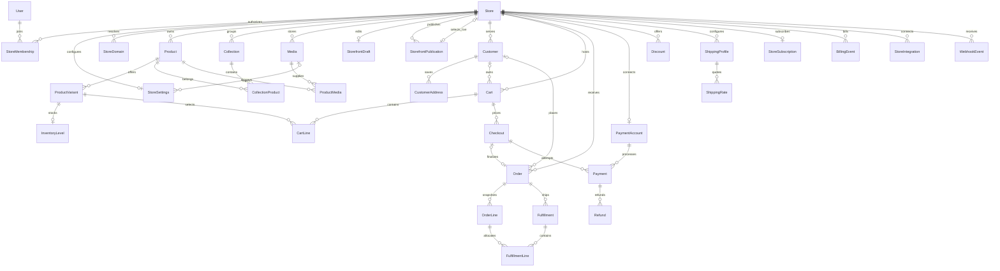

# Jellyshops commerce data model

The full commerce target is in [commerce.prisma](../prisma/reference/commerce.prisma).
The operational [schema.prisma](../prisma/schema.prisma) now contains only the
phase-one tenant and storefront slice. See [phase-one migration](phase-one-migration.md)
for the prepared SQL, verification and deployment boundaries.
This is a schema deliverable, not an enabled commerce backend. The Express app
still uses development authentication, local JSON storefronts, local media, and a
demo catalog. No database migration has been applied.

## Relationship map



Every merchant-owned record has a storeId, including child and join records.
Some children reach Store through their parent rather than a redundant direct
foreign key. For example, InventoryLevel reaches Store through ProductVariant
and Product. Checkout also belongs directly to Store, omitted from the diagram
to keep it readable.

## Identity, ownership and compatibility

- Preserve the existing integer User.id, name, email and createdAt columns.
  New entities use string UUID defaults, matching existing string store and
  publication identifiers. IDs remain PostgreSQL text so existing demo IDs can
  be imported deliberately.
- firebaseUid is nullable and unique for an additive transition. Link existing
  users only after verifying Firebase identity; email alone is not proof of
  account ownership. MerchantPrincipal.merchantId remains a string at the API
  boundary; the future adapter must map the verified identity to User.id.
- StoreMembership has one row per user/store and an explicit role. There is no
  permanent storeId on User. Creating a store and its OWNER membership must be
  one transaction. Prevent removing the final owner in the membership service.
- Store currency and country are required. Currency is the denomination for
  catalog prices, discounts and shipping rates; carts, checkout, orders and
  payments snapshot it. Do not change store currency while monetary records
  exist without a deliberate conversion workflow.
- Archive stores, products and variants rather than cascading deletion through
  commerce history. Foreign keys use Restrict. Customer erasure requires an
  explicit anonymization/retention workflow, including address and event JSON.
- Existing local JSON files are not imported automatically. Keep the current
  repository active until the Prisma implementation and data import are tested.

## Database guarantees and service responsibilities

| Concern | Enforced by this schema | Required before runtime rollout |
|---|---|---|
| Tenant relationships | Composite foreign keys include storeId | Authenticate membership and scope every query; foreign keys do not authorize reads |
| Membership | Unique user/store pair | Role permissions and final-owner protection |
| Catalog | Store-scoped slugs, SKUs and external IDs | Normalize slugs/SKUs; validate product options and active status |
| Fulfillment | Lines belong to the same store AND order as their fulfillment | Positive quantities and transactional aggregate shipped quantity limits |
| Publishing | Live pointer can only target a publication in the same store | Atomic revision comparison, snapshot insert and pointer update; prohibit publication updates/deletes |
| Checkout retries | Store-scoped idempotency key; one order per checkout | Compare retry request fingerprints; serialize checkout attempts for a cart |
| Provider retries | Unique account/event key, unique account/payment-intent key | Verify signature before trusting payload, durable claiming/retry, atomic effects and event completion |
| Money | Integer minor units, explicit snapshot currency | Nonnegative bounds, safe-integer arithmetic, currency agreement, totals equations |
| Inventory | One level per variant | Nonnegative stock/reserved, reserved <= quantity, atomic reservation and release |
| Historical orders | Independent title, variant, SKU, price, discount and tax snapshots | Validate snapshot origin and freeze financial history after finalization |
| Discounts | Store-scoped code and explicit discount kind | Code normalization, exclusive amount/percentage fields, valid basis points/dates, redemption accounting |
| Integration | SHOPIFY-only IntegrationProvider enum; unique provider/store and external store identities | Verified domain/account mapping, encrypted credential rotation |

Prisma validation checks the model and relationships; it does not establish the
service rules above. Add PostgreSQL CHECK constraints in the eventual reviewed
migration for positive quantities, nonnegative monetary values, inventory bounds,
discount alternatives/ranges, timestamp ranges and total equations. These checks
are not expressible directly in this Prisma schema. Cross-row rules still require
transactions even after those constraints are installed.

## Catalog, media and storefront

Product data lives outside theme JSON. CollectionProduct defines collection
membership and position; ProductMedia supplies ordered images with alt text.
InventoryLevel deliberately represents one stock pool per variant. Multi-location
stock, reservation records and stock movement audit trails are later additions.

Checkout is excluded from the first runtime slice. Before enabling carts and
checkout, add per-checkout InventoryReservation records with tenant-safe variant
and checkout relations, quantities, expiry times and lifecycle status. The
aggregate reserved counter alone cannot identify which abandoned checkout's
stock should be released.

Collection, Discount, ShippingProfile, ShippingRate, CustomerAddress and
StoreDomain carry createdAt and updatedAt lifecycle timestamps. Prisma maintains
updatedAt for client writes; raw SQL and other writers must update it explicitly.
Join tables retain their existing shape.

StorefrontDraft preserves the existing storeId, revision, document and updatedAt
contract. StorefrontPublication preserves id, storeId, sourceRevision, document
and publishedAt. Store.currentPublicationId replaces the local JSON pointer.

Both document columns are JSONB under the PostgreSQL connector. Their contents
continue to use the shared storefront schema validator. Supporting future page
templates, sections and blocks does not require another database shape, but does
require versioned document validation, migration and renderer support. This task
does not change the frontend document contract.

Media.storageKey replaces the filesystem-specific storagePath concept and can hold
a GCS object key. Media.url is the delivery URL. The existing referenced boolean
is not authoritative: catalog/logo foreign keys and references inside draft and
publication JSON must all be checked before deleting an object. JSON references
cannot be protected by ordinary foreign keys.

## Cart, checkout and orders

CartLine stores a variant and quantity, never an authoritative price.
Cart.tokenHash stores a hash of a separate high-entropy access secret, not the
raw secret; possession of a cart ID alone must not grant access.

Checkout records cartRevision, an idempotency key, address snapshots and a
server-generated lineSnapshots payload. The pricing service must define and
validate a versioned payload containing variant/product identifiers, title/SKU,
quantity, unit amount, discounts and taxes. Expire or lock stale checkouts;
only one payable attempt may reserve a given cart's stock at a time.

Order.checkoutId is optional so Shopify-imported orders do not require a fake
native checkout. Native checkout completion creates one order transactionally.
Allocate orderNumber per store with a transaction and retry against the unique
constraint, not an unguarded max-plus-one.

OrderLine productId/variantId are historical identifiers, intentionally not live
catalog foreign keys. Always copy them from server-validated catalog data.
Snapshot discount and tax fields are line totals; priceSnapshotMinor is the unit
price. subtotal is the sum of unit price times quantity. total equals subtotal
minus discountTotal plus shippingTotal plus taxTotal. Use tax-exclusive
accounting for this initial model and store the detailed tax computation in the
checkout snapshot.

Payment, fulfillment and order status are separate enums. They must transition
through services rather than arbitrary updates. FulfillmentLine ties each shipment
to the exact order line; aggregate quantities and returned units need lifecycle
logic. Returns, line-level refund allocations and exchange records are later work.

## Payments, billing and integration boundaries

PaymentAccount represents the merchant's Stripe Connect account. Payment records
belong to a Checkout and that store's account; retries may create multiple payment
attempts. An order's native payments are reachable through its checkout, avoiding
two competing order/checkout pointers. Refund belongs to Payment and uses the same
currency. Account IDs are immutable once payments reference them.

StoreSubscription represents the merchant paying Jellyshops. BillingEvent is its
separate event inbox; consumer checkout events belong in WebhookEvent.
This schema does not choose a Stripe Connect charge topology or implement Stripe
API calls. Choose that topology before implementing payments and confirm its
account, fee, transfer and refund requirements against current provider docs.

WebhookEvent keys include provider, externalAccountId and externalEventId.
Resolve the store from a trusted integration/account mapping after signature
verification. Payload store IDs are not trusted routing authority. Both inbox
types have status, attempts and lock expiry for durable workers. Record effects
and PROCESSED status in one database transaction; use provider idempotency for
external effects. occurredAt can assist reconciliation but does not by itself
solve out-of-order delivery. Provider-specific object versions belong in the
future sync implementation.

NATIVE means Jellyshops owns catalog, inventory, checkout and orders.
SHOPIFY means Shopify owns commerce and Jellyshops owns storefront design.
The catalog/order tables can hold imported projections using externalId; native
mutation services must reject Shopify-owned commerce operations. Shopify carts
and checkout URLs belong to the future adapter, not native Payment records.
Changing commerce mode requires an explicit reconciliation process.

StoreIntegration holds envelope-encrypted credentials and a key identifier.
Do not store plaintext OAuth tokens or secrets in event payloads. Limit and
redact payload retention. StoreIntegration uses a separate IntegrationProvider
enum containing only SHOPIFY. Store.commerceProvider remains NATIVE or SHOPIFY;
NATIVE cannot be stored as an integration provider. Stripe Connect remains under
PaymentAccount.

## Scope choices

This foundation models all entities proposed at the end of the brief, plus explicit
product-media relationships. Shipping profiles are store-wide; taxes are versioned
settings and checkout/order snapshots. It does not pretend to implement tax rules,
discount redemption counters, multi-location stock, subscriptions invoicing,
returns, provider synchronization or background workers. Add dedicated models
when those domain services are designed.

Int minor-unit fields use PostgreSQL signed 32-bit integers. Reject amounts and
totals outside that range. If business limits require larger amounts, adopt BigInt
with an explicit JSON serialization contract before enabling checkout.

Normalize country/currency codes and domain names in services. StoreDomain has no
primary-domain flag in this phase, avoiding ambiguous multiple-primary records.
Optional external IDs use PostgreSQL nullable uniqueness so native records can
omit them. Customer email is indexed, not unique: guest checkouts and identity
merges must not silently join people based only on a matching email.

## Validation and rollout

Supabase Postgres is the initial hosted database. Firebase remains the merchant
authentication provider, and Prisma remains the only application database access
layer. The model deliberately uses standard PostgreSQL features so it is not tied
to Supabase-specific APIs. Runtime queries use a pooled DATABASE_URL; migrations
use a separate DIRECT_URL with a more privileged database role.

The first production database slice is User, Store, StoreMembership,
StoreSettings, StoreDomain, StorefrontDraft and StorefrontPublication. Implement
FirebaseAuthProvider, verified user lookup and membership authorization, then
PrismaStorefrontRepository behind the existing StorefrontService contract.
Preserve the editor's storefront API and versioned document contract; supplying
a real Firebase token still requires the merchant authentication flow.

The full schema is a long-term target, not a ready-to-apply phase-one migration.
The operational schema now contains only the first slice: StoreSettings.logoMediaId
and its Media relation, shipping/tax settings and Store's future commerce relations
are deferred. The complete target schema remains in prisma/reference/commerce.prisma.
The prepared migration creates only phase-one tables; it has not been deployed.

Subsequent slices are catalog and media; cart and inventory reservations;
checkout and Stripe Connect; orders, fulfillment and refunds; subscription
billing; and Shopify integration. Add each slice's CHECK constraints in its
reviewed migration. The first slice needs revision bounds and publication
immutability; monetary and inventory constraints arrive with those tables.

From backend:

```powershell
.\node_modules\.bin\prisma.cmd format
.\node_modules\.bin\prisma.cmd validate
npm run typecheck
npm test
```

Update prisma.config.ts to read DIRECT_URL before deployment. Schema validation
needs a syntactically valid configuration value but does not connect to the
database. Never publish credentials in logs, documentation or frontend variables.

Before deployment:

1. Review the schema with the domain owners and choose the first runtime slice.
2. Generate a migration against an isolated development database. Keep the
   existing init migration intact; add custom CHECK constraints and publication
   immutability enforcement to the new migration.
3. Inspect SQL and exercise it against a copy of existing data. Backfill verified
   Firebase links and intended memberships; do not invent tenant ownership.
4. Generate the Prisma client and implement repositories behind current contracts.
5. Test cross-store rejection, concurrent draft writes, immutable publications,
   checkout/payment retries, inventory races and fulfillment quantity limits.
6. Deploy the reviewed migration separately from switching repository providers.

No Prisma client regeneration or database mutation is part of this deliverable.
